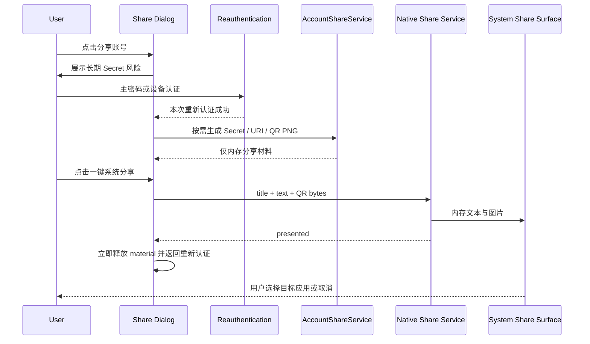

# 阶段 11 状态：原生系统分享

- 完成日期：2026-07-17
- 当前结论：已完成单账号完整凭据包的 macOS/Windows 原生系统分享链路。用户必须先通过主密码、Touch ID 或 Windows Hello 重新认证，应用才会按需生成账号名称、Base32 Secret、`otpauth://` URI 和 QR PNG；原生层只接收内存数据，不创建明文临时文件。系统分享面板成功打开后，Flutter 立即释放当前分享材料并要求再次认证。macOS Debug 构建已通过；阶段 12 已补充 Windows Server 2022/MSVC Debug 编译闭环，仍需 Windows 10/11 真机运行与分享目标矩阵验收。

## 本阶段已完成

### Dart 平台边界

- [x] 新增 `NativeAccountShareService`，隔离 Flutter UI 与 macOS/Windows 原生分享实现。
- [x] 新增 `NativeAccountSharePayload`，统一携带分享标题、文本和 QR PNG 字节。
- [x] 新增 `NativeAccountShareResult`，统一表示 `presented`、`unavailable` 和 `cancelled`。
- [x] 使用 `google_code/native_account_share` / `shareAccount` 作为统一 MethodChannel 协议。
- [x] Dart 调用前校验标题、正文和二维码；QR PNG 限制为 1 byte 至 5 MiB。
- [x] 非 macOS/Windows 平台以及 MissingPlugin 安全返回 `unavailable`，保留复制与保存降级路径。
- [x] 原生返回未知状态时抛出受控 `PlatformException`，由 UI 显示通用失败提示，不暴露底层敏感信息。

MethodChannel 参数：

```text
{
  title: String,
  text: String,
  qrPng: Uint8List
}
```

分享正文包含：

```text
TOTP 账号：<issuer · account name>
Base32 Secret：<secret>
配置链接：<otpauth:// URI>
安全提示：获得这些内容的人可以持续生成该账号的验证码。
```

### 分享 UI 与重新认证

- [x] 在已有账号分享对话框增加“一键系统分享”区域和“分享 Secret + 二维码”按钮。
- [x] 沿用阶段 7、阶段 9 的安全边界：未完成本次重新认证时不生成 Secret、URI 或二维码。
- [x] 支持已配置的 Touch ID / Windows Hello 设备认证，并始终保留主密码回退。
- [x] 原生分享一次发送账号标识、Base32 Secret、标准 URI 和 QR PNG，便于在目标应用中完整迁移。
- [x] 分享调用期间禁用关闭、隐藏和重复分享按钮，避免并发状态覆盖。
- [x] 系统面板成功打开或用户取消后立即清理 `_material`、计时器和显示状态，返回重新认证界面。
- [x] 原生面板不可用或调用失败时保留当前已认证材料，用户可改用复制 Secret、复制 URI 或保存二维码 PNG。
- [x] 分享文本持续展示长期凭据泄露风险；Secret 一旦交给目标应用，Google Code 无法远程撤销。

### macOS 原生实现

- [x] 使用 `NSSharingServicePicker` 展示系统分享目标。
- [x] 分享项目只包含内存中的 `String` 与 `NSImage`，不创建二维码临时文件。
- [x] `NativeAccountShareCoordinator` 强引用 picker 与分享项目，避免选择目标前提前释放。
- [x] 同一时刻只允许一个 picker；已有 picker 未结束时拒绝新的分享请求。
- [x] 用户选择目标或取消后清除应用持有的 picker、文本和图像引用。
- [x] MethodChannel 在 picker 成功展示后立即返回 `presented`，使 Dart 侧马上隐藏凭据。
- [x] macOS Debug 应用已完成 Swift 原生编译。

### Windows 原生实现

- [x] 使用 Win32 `IDataTransferManagerInterop::GetForWindow` 与 `ShowShareUIForWindow` 打开当前窗口的系统分享 UI。
- [x] `DataRequested` 回调向 `DataPackage` 写入标题、文本和二维码 bitmap。
- [x] QR PNG 使用 `SHCreateMemStream` 与 `CreateRandomAccessStreamOverStream` 构造内存随机访问流，不执行异步磁盘写入。
- [x] `RandomAccessStreamReference` 直接交给 `DataPackage.SetBitmap`，不创建明文临时文件。
- [x] `DataPackage` 接管数据后立即释放 runner 持有的 pending 文本、流和 bitmap 引用。
- [x] 同一时刻只允许一个 pending 分享请求，避免后一次调用覆盖前一次敏感材料。
- [x] runner 已链接 `shcore.lib`、`shlwapi.lib` 与 `windowsapp.lib`。
- [x] 阶段 12 已在 Windows Server 2022 GitHub Actions Runner 完成 MSVC Debug 编译与链接。
- [ ] 仍需在 Windows 10/11 真机完成系统分享运行和目标应用验收。

## 安全生命周期



安全边界：

- 应用不会把原生一键分享内容写入 Vault、日志、缓存或临时文件。
- 原生系统与目标应用接收数据后，Google Code 无法控制其缓存、历史记录、云同步或再次转发行为。
- Dart/Swift/C++ 的对象生命周期缩短不能承诺对进程物理内存绝对清零；当前目标是及时删除应用引用并避免额外持久化副本。
- 复制 Secret、复制 URI 和显式保存二维码仍是稳定降级路径；保存二维码只写入用户在系统文件对话框明确选择的位置。

## 当前验证结果

| 检查项 | 结果 |
| --- | --- |
| `fvm dart format lib test tool` | 通过，100 files，0 changed |
| `fvm flutter analyze` | 通过，0 issues |
| `fvm flutter test` | 通过，100 tests |
| `fvm flutter build macos --debug` | 通过，生成 `build/macos/Build/Products/Debug/google_code.app` |
| Windows 原生构建 | 阶段 12 GitHub Actions/MSVC Debug 构建通过 |
| Windows 原生运行 | 待 Windows 10/11 真机验证 |

自动化测试覆盖完整 MethodChannel payload、平台结果映射、MissingPlugin 与不支持平台降级、空字段和超大二维码拒绝，以及分享按钮发送 Secret、URI、QR bytes 后立即隐藏材料并返回重新认证界面。

## 当前限制与风险

- [ ] Windows 原生代码已通过 MSVC 编译；仍需在 Windows 10/11 真机验证系统分享 UI 和目标应用接收文本/PNG 的行为。
- [ ] Windows 需分别验证打包与当前分发形态下 `DataTransferManager` 的可用性；不可用时必须正确显示降级提示。
- [ ] macOS 已通过 Debug 编译，但需在目标签名/Sandbox 环境人工验证 AirDrop、邮件、信息等目标是否同时接收文本和二维码。
- [ ] 系统分享面板成功展示不代表目标应用最终完成发送；应用为缩短凭据生命周期，不等待目标应用结果。
- [ ] 目标应用可能保留 Secret、URI 或二维码历史；用户分享前必须确认接收方和目标应用可信。
- [ ] QR 图片与正文包含同一个长期 TOTP Secret，任一项泄露都足以持续生成验证码，除非用户在原服务重新绑定二次验证。

## 下一阶段建议

1. 在 Windows 10/11 真机下载阶段 12 CI Debug 产物，并验证系统分享面板、取消、无分享目标、连续分享和应用关闭场景；Release 构建留到发布阶段。
2. 在 macOS 目标签名/Sandbox 环境验收 AirDrop、邮件、信息等常用分享目标，同时确认 picker 选择/取消后的内存引用释放。
3. 将 macOS/Windows 原生分享、系统会话事件、设备安全存储和文件对话框纳入发布前真机矩阵。
4. 使用真实 Google Authenticator 导出样本继续完成阶段 6 兼容性回归。
5. 进入摄像头二维码扫描 PoC；自动化 Debug CI 已由阶段 12 完成，发布签名和安装包留到后续阶段。
