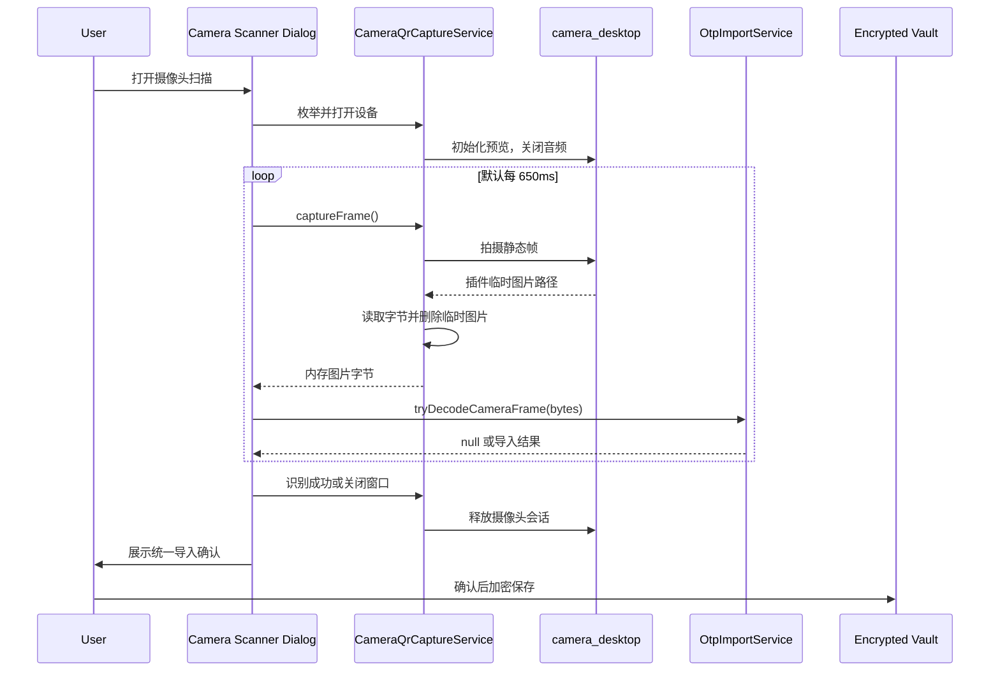

# 阶段 13 状态：macOS/Windows 摄像头二维码扫描 PoC

- 完成日期：2026-07-17
- 实现提交：`9b769adeb6de6c1757b145b5eb919d90c9bbc58e`
- 当前结论：已完成 macOS/Windows 摄像头二维码扫描 PoC，并通过应用自有接口隔离第三方桌面摄像头实现。应用可以枚举和切换摄像头、显示实时预览、周期抓取静态帧，并复用现有标准 `otpauth://` 与 Google Authenticator 迁移二维码导入流程。Linux 质量检查、macOS AVFoundation Debug 构建和 Windows Media Foundation/MSVC Debug 构建均已在 GitHub Actions 通过。当前结论仅代表代码、自动化测试与双平台编译闭环完成；macOS 真实摄像头扫码以及 Windows 10/11 真机预览、权限和扫码交互仍需人工验收。

## 本阶段目标

1. 为 macOS 和 Windows 提供统一的摄像头扫描入口。
2. 不让账号页和导入业务直接依赖具体摄像头插件。
3. 复用已有 QR 解码、导入确认、重复检测、Google 迁移批次和加密保存流程。
4. 不上传画面，不长期保存帧，不申请无关的麦克风权限。
5. 保持 Linux 自动化测试以及 macOS、Windows Debug 构建闭环。

## 技术选型

采用以下固定依赖：

```yaml
camera: 0.12.0+2
camera_desktop: 1.2.1
```

选型理由：

- `camera` 提供 Flutter 标准 Dart API、控制器和预览 Widget。
- `camera_desktop` 实现 `camera_platform_interface`，在 macOS 使用 AVFoundation，在 Windows 使用 Media Foundation。
- macOS 和 Windows 均支持摄像头枚举、预览和拍照。
- Windows 实现不支持 image stream，因此 PoC 没有建立持续视频帧传输，而是使用跨平台一致的周期静态帧抓取方案。
- 应用只依赖自有 `CameraQrCaptureService`，后续可以替换为自有原生元数据扫描插件，而不改动导入业务和账号页面编排。

依赖安装期间本机访问 `pub.dev` 曾出现过期证书错误，临时通过 Flutter 中国镜像完成下载；仓库中的 `pubspec.lock` source URL 已恢复为 `https://pub.dev`，没有把镜像地址写入项目配置。

## 本阶段已完成

### 摄像头平台边界

新增 `lib/platform/camera/camera_qr_capture_service.dart`：

- [x] `CameraQrCaptureService`：枚举设备并打开摄像头会话。
- [x] `CameraQrCaptureSession`：提供预览、单帧抓取和会话释放。
- [x] `CameraQrCaptureDevice`：向 UI 暴露稳定设备标识、名称和镜头方向。
- [x] `CameraQrCaptureException`：将不支持、无设备、权限拒绝、设备不可用和抓帧失败映射为不包含原生路径或底层诊断信息的安全错误。
- [x] `DesktopCameraQrCaptureService`：仅在 macOS/Windows 生产环境启用，测试可用 `platformSupportedOverride` 覆盖平台判断。
- [x] 使用 `ResolutionPreset.medium`，并通过 `enableAudio: false` 禁用音频。
- [x] Windows 前置摄像头预览水平镜像，避免用户操作方向相反。
- [x] 每次拍照后读取图片字节，并在读取完成后立即删除插件生成的临时图片。
- [x] 页面关闭或切换设备时释放摄像头控制器和操作系统设备句柄。

### 摄像头扫描对话框

新增 `lib/features/accounts/camera_qr_scanner_dialog.dart`：

- [x] 初始化、加载、预览、错误和重试状态。
- [x] 多摄像头设备选择和切换。
- [x] QR 取景框覆盖层。
- [x] 默认每 650ms 抓取一帧并调用统一 QR 解码流程。
- [x] 无二维码或瞬时损坏帧时继续扫描，不向用户弹出重复错误。
- [x] 识别到第一个支持的二维码后立即关闭对话框并抑制重复触发。
- [x] 对话框关闭后释放摄像头会话。
- [x] 明确提示画面只在本机处理，临时截图读取后立即删除。
- [x] 使用可滚动对话框布局，避免小窗口下内容垂直溢出。

### 统一导入流程

修改以下文件：

```text
lib/application/import/otp_import_service.dart
lib/app/state/import_providers.dart
lib/features/accounts/accounts_page.dart
```

完成内容：

- [x] 新增 `OtpImportService.tryDecodeCameraFrame(Uint8List bytes)`。
- [x] 无二维码或瞬时损坏帧返回 `null`，由扫描循环继续处理下一帧。
- [x] 识别后复用现有标准 `otpauth://totp` 和 `otpauth-migration://` 解码逻辑。
- [x] 导入来源标记为 `OtpImportSource.camera`。
- [x] 新增可覆盖的 `cameraQrCaptureServiceProvider`，便于 Widget 测试隔离硬件。
- [x] 账号页新增“摄像头扫描”入口。
- [x] 单账号结果复用现有确认、重复检测和加密 Vault 保存流程。
- [x] Google Authenticator 多二维码迁移批次支持“继续摄像头扫描”。

### macOS 权限

修改：

```text
macos/Runner/Info.plist
macos/Runner/DebugProfile.entitlements
macos/Runner/Release.entitlements
```

新增摄像头用途说明：

```xml
<key>NSCameraUsageDescription</key>
<string>用于扫描您主动展示的 TOTP 二维码，画面不会上传或长期保存。</string>
```

新增 App Sandbox 摄像头 entitlement：

```xml
<key>com.apple.security.device.camera</key>
<true/>
```

扫描会话禁用音频，因此没有申请麦克风权限。

### 桌面插件注册

摄像头依赖已进入 Flutter 自动生成的桌面插件注册文件：

```text
macos/Flutter/GeneratedPluginRegistrant.swift
windows/flutter/generated_plugin_registrant.cc
windows/flutter/generated_plugins.cmake
```

这些文件已分别通过 macOS Swift/AVFoundation 和 Windows C++/Media Foundation 编译闭环。

## 扫描与数据生命周期



安全约束：

- 摄像头画面和抓取帧不上传服务器，不进入 Vault、日志或备份。
- 应用不主动保存帧；插件拍照产生的临时图片在读取完成后立即删除。
- QR 文本和 Secret 继续遵守现有导入流水线的内存与日志约束。
- 不启动麦克风，不申请麦克风权限。
- 操作系统、驱动或第三方插件内部可能存在应用无法控制的缓冲区；本阶段只能保证 Google Code 不主动长期持久化或上传画面。

## 自动化测试

本阶段新增 6 项测试，自动化测试总数从 100 增加到 106：

### `test/application/import/otp_import_service_test.dart`

- [x] 摄像头帧解析后来源为 `OtpImportSource.camera`。
- [x] 无二维码帧返回 `null`。
- [x] 非 OTP 二维码被统一导入规则拒绝。

### `test/features/accounts/camera_qr_scanner_dialog_test.dart`

- [x] 返回第一个支持的二维码结果。
- [x] 返回 `SingleOtpImportResult` 并验证账号内容。
- [x] 扫描对话框关闭后释放摄像头会话。
- [x] 无摄像头时展示安全错误和重试入口。

### `test/platform/camera/camera_qr_capture_service_test.dart`

- [x] 不支持的平台在调用摄像头插件前被拒绝。

## 验证结果

### 本地验证

| 检查项 | 结果 |
| --- | --- |
| `fvm dart format --output=none --set-exit-if-changed lib test tool` | 通过，104 files，0 changed |
| `fvm flutter analyze` | 通过，0 issues |
| `fvm flutter test` | 通过，106 tests |
| `fvm flutter build macos --debug` | 通过，生成 `build/macos/Build/Products/Debug/google_code.app` |
| `git diff --check` | 通过 |

### GitHub Actions 实现提交运行

- 运行编号：`29564583502`
- 提交：`9b769adeb6de6c1757b145b5eb919d90c9bbc58e`
- 结果：全部通过
- 运行地址：`https://github.com/geng452654716/google-code/actions/runs/29564583502`

| Job | Runner | 结果 | 用时 |
| --- | --- | --- | --- |
| Quality checks | `ubuntu-24.04` | 通过，106 tests | 1m55s |
| macOS debug build | `macos-15` | 通过，产物已上传 | 2m32s |
| Windows debug build | `windows-2022` | 通过，产物已上传 | 3m59s |

## 当前限制与风险

- [ ] macOS 摄像头真实预览、首次 TCC 授权、拒绝后重试、设备切换和实际二维码识别尚未完成人工验收。
- [ ] Windows 10/11 真机摄像头预览、权限、设备占用、设备切换和实际二维码识别尚未完成人工验收。
- [ ] `camera_desktop` 是第三方桌面插件，存在维护活跃度、供应链、操作系统升级兼容性和上游修复时效风险。
- [ ] Windows 不支持 image stream；默认 650ms 周期拍照的 CPU、内存、设备快门行为和长期运行稳定性需要真机评估。
- [ ] 当前使用 Dart 图片解码与 `zxing2` 识别，没有使用 AVFoundation/Media Foundation 的原生二维码元数据输出；低端设备上的延迟仍需测量。
- [ ] 摄像头被其他应用占用、运行中拔出、系统睡眠恢复和应用自动锁定时的资源释放需要加入真机异常矩阵。
- [ ] CI Runner 只验证编译和无硬件自动化测试，不代表真实摄像头设备已工作。

## 下一阶段建议

1. 在 macOS 真机完成摄像头权限、前后置/外接设备切换、标准二维码和 Google 迁移二维码扫描验收。
2. 在 Windows 10/11 真机下载 CI 产物，完成摄像头与阶段 12 其他平台能力的联合验收。
3. 对 650ms 抓帧策略测量 CPU、内存、识别延迟和设备稳定性；必要时调整分辨率或间隔。
4. 审查 `camera_desktop` 的维护状态、许可证和依赖链；若风险不可接受，设计自有 AVFoundation/Media Foundation 元数据扫描插件替换 `CameraQrCaptureService` 实现。
5. 进入发布准备阶段：Release 构建、macOS 签名/公证、Windows 代码签名与安装包、依赖审计和产物校验值。
