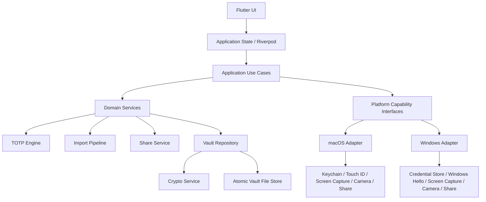
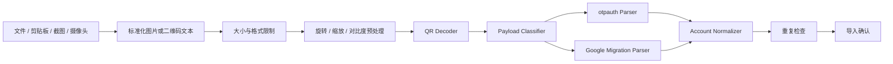
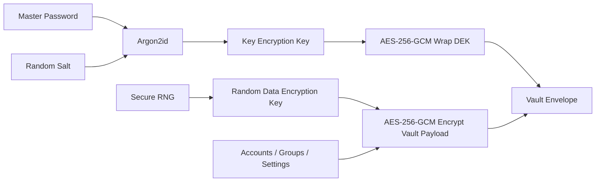
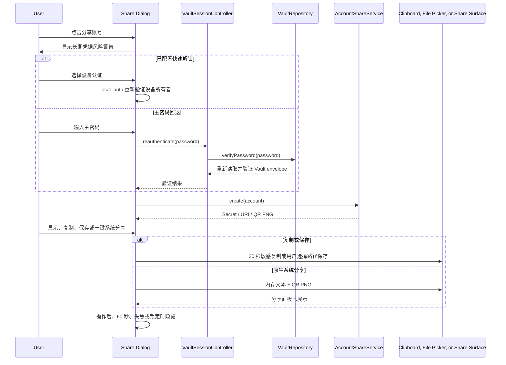

# Google Code 桌面动态验证码生成器技术设计文档

- 文档版本：v0.4（阶段 18 实现同步）
- 更新日期：2026-07-20
- 对应需求：`docs/PRD.md` v0.1
- 推荐技术栈：Flutter Desktop + Dart
- 推荐首发平台：macOS、Windows
- 系统形态：纯本地离线桌面应用，无后端服务

## 1. 文档目的

本文档将产品需求转化为可实施的软件架构，重点覆盖：

- TOTP 动态验证码的正确实现。
- 本地密钥加密、主密码和设备认证快速解锁。
- 图片、剪贴板、区域截图、摄像头二维码导入。
- Google Authenticator 迁移二维码解析。
- 单个账号 Secret、`otpauth://` 链接和二维码安全分享。
- 本地分组管理、筛选与桌面拖拽归类。
- macOS、Windows 平台能力适配。
- 模块拆分、数据格式、测试、构建和发布。

本文档用于指导工程初始化、任务拆分、代码评审和验收。尚未确认的产品选择以“技术假设”方式记录，实施前可以通过 ADR 修订。

## 2. 技术假设

当前方案基于以下假设：

1. 首发目标为 **macOS + Windows**，Linux 暂不纳入首版验收。
2. 使用 Flutter Desktop；界面和业务逻辑共用 Dart，系统能力通过插件或自有 Platform Channel 适配。
3. P0 必须支持主密码；Touch ID、Windows Hello 或设备凭据作为 P1 快速解锁和敏感操作重新认证能力。
4. 数据不上传服务器，应用运行不依赖网络。
5. TOTP 默认参数为 SHA-1、6 位、30 秒，同时兼容 URI 中合法的 SHA-256、SHA-512、8 位和其他周期。
6. P0 支持图片、剪贴板和区域截图导入；P1 摄像头扫描 PoC 已在阶段 13 实现，真机验收仍待完成。
7. 单个账号分享暂列 P1；包含 Secret、`otpauth://` 链接、二维码、保存图片和平台允许时调用系统分享面板。
8. 首版不允许 CSV/JSON 明文批量导出，只提供加密备份。
9. 一个账号只属于一个分组，后续如需要多分组再升级数据模型。
10. 账号规模目标为 1000 条，优先使用整体加密 Vault 文件，而不是数据库。

## 3. 技术选型结论

### 3.1 推荐 Flutter Desktop

选择 Flutter 的主要原因：

- 官方支持构建原生 macOS、Windows 和 Linux 桌面应用。
- 单一 UI 代码库适合本项目的个人工具定位。
- Dart 业务层适合实现 TOTP、URI 解析、加密文件和二维码解析。
- `local_auth` 官方插件已覆盖 macOS 和 Windows。
- 截图、剪贴板、安全存储等能力可以隔离在平台适配层，后续替换插件不会影响领域层。
- 用户后续如扩展移动端，可以复用大部分领域逻辑和 UI 组件。

### 3.2 不选择 Electron 作为首选

Electron 对摄像头、剪贴板和屏幕捕获支持较直接，但存在以下取舍：

- 安装包和运行时资源占用通常更大。
- 需要额外控制 Node.js、Renderer、IPC 和内容安全策略的攻击面。
- 系统设备认证和密钥安全存储仍需要平台能力。
- 本项目不需要 Web 技术生态或在线内容加载。

阶段 13 已使用 `camera` + `camera_desktop` 完成 Windows 摄像头编译 PoC，目前不需要因此重新评估 Electron；若后续真机性能、稳定性或第三方插件供应链风险不可接受，可优先在现有平台接口后替换为自有原生实现。

### 3.3 不选择 Tauri 作为首选

Tauri 安装体积和权限模型较好，但该方案会同时引入 Rust、Web 前端和平台插件维护，团队需要维护更多语言边界。本项目核心算法和 UI 均可在 Dart 内完成，因此首版不优先采用。

## 4. 开发基线

### 4.1 SDK

- Flutter：通过 FVM 固定为 Flutter 3.44.0。
- Dart：使用 Flutter 3.44.0 内置的 Dart 3.12.0。
- macOS 最低版本：建议 macOS 12；最终以插件兼容性和签名要求确认。
- Windows 最低版本：建议 Windows 10 19041；最终以设备认证、截图和摄像头适配结果确认。
- 架构：macOS arm64/x64，Windows x64；Windows arm64 后置。

项目、开发命令和 GitHub Actions 均使用同一 FVM 版本；升级 Flutter 或桌面平台插件时必须单独提交并完成 Linux 质量检查及 macOS/Windows Debug 构建。

### 4.2 版本固定

建议提交以下文件：

- `.fvmrc`：固定 Flutter SDK。
- `pubspec.lock`：应用项目必须提交依赖锁文件。
- CI 使用与 `.fvmrc` 一致的版本。
- 升级 Flutter 或安全相关依赖时单独提交，并运行完整回归测试。

## 5. 总体架构

采用“领域层无平台依赖 + 功能模块化 + 平台适配器”的本地单体架构。



### 5.1 分层职责

#### Presentation

- 页面、对话框、列表和交互状态。
- 不直接读写文件、调用加密 API 或访问平台插件。
- 不持有长期明文 Secret。

#### Application

- 编排解锁、导入、保存、分享、备份和恢复用例。
- 维护当前会话状态和自动锁定。
- 将领域错误转换为用户可理解的错误状态。

#### Domain

- Account、Group、Vault 等实体。
- TOTP 计算、Base32、`otpauth://` 解析和生成。
- 重复项判断、导入校验、Google 迁移数据归一化。
- 不依赖 Flutter Widget 和具体插件。

#### Infrastructure

- Vault 文件读写和迁移。
- AES-GCM、Argon2id、随机数和密钥包装。
- QR 图片解码、生成和图片预处理。
- 日志、安全存储和本地设置。

#### Platform

- 区域截图、剪贴板图片、摄像头、系统分享面板。
- 设备认证、系统锁屏事件、窗口失焦保护。
- 插件或自有原生代码只从该层暴露接口。

## 6. 推荐项目结构

```text
google-code/
├── docs/
│   ├── PRD.md
│   ├── TECHNICAL_DESIGN.md
│   └── adr/
├── lib/
│   ├── main.dart
│   ├── app/
│   │   ├── app.dart
│   │   ├── bootstrap.dart
│   │   ├── router.dart
│   │   └── theme/
│   ├── core/
│   │   ├── errors/
│   │   ├── logging/
│   │   ├── result/
│   │   ├── security/
│   │   └── utils/
│   ├── domain/
│   │   ├── entities/
│   │   ├── repositories/
│   │   ├── services/
│   │   └── value_objects/
│   ├── data/
│   │   ├── vault/
│   │   ├── crypto/
│   │   ├── import/
│   │   ├── backup/
│   │   └── settings/
│   ├── platform/
│   │   ├── authentication/
│   │   ├── clipboard/
│   │   ├── screen_capture/
│   │   ├── camera/
│   │   ├── sharing/
│   │   └── session_lock/
│   └── features/
│       ├── onboarding/
│       ├── unlock/
│       ├── accounts/
│       ├── import_accounts/
│       ├── groups/
│       ├── share_account/
│       ├── backup_restore/
│       └── settings/
├── test/
│   ├── unit/
│   ├── fixtures/
│   ├── golden/
│   └── security/
├── integration_test/
├── macos/
├── windows/
├── pubspec.yaml
└── .fvmrc
```

## 7. 核心接口设计

通过抽象接口隔离业务和具体插件：

```dart
abstract interface class TotpService {
  String generate(TotpConfig config, DateTime timestamp);
  int remainingSeconds(TotpConfig config, DateTime timestamp);
}

abstract interface class VaultRepository {
  Future<VaultStatus> inspect();
  Future<UnlockedVault> create(NewVaultRequest request);
  Future<UnlockedVault> unlock(UnlockCredential credential);
  Future<void> save(UnlockedVault vault);
  Future<void> lock();
}

abstract interface class QrDecoder {
  Future<List<DecodedQrPayload>> decodeImage(Uint8List bytes);
}

abstract interface class ScreenCaptureService {
  Future<Uint8List?> captureRegion();
  Future<void> openPermissionSettings();
}

abstract interface class ClipboardService {
  Future<ClipboardPayload?> read();
  Future<void> writeSensitiveText(String text, Duration ttl);
  Future<void> writeImage(Uint8List pngBytes);
}

abstract interface class ReauthenticationService {
  Future<bool> verify(ReauthenticationReason reason);
}

abstract interface class AccountShareService {
  Future<ShareMaterial> prepare(AccountId accountId);
  Future<ShareResult> share(ShareRequest request);
}
```

接口返回领域结果，不向上层暴露插件异常、临时文件路径或平台原始对象。

## 8. 领域模型

### 8.1 Account

```dart
class Account {
  final String id;
  final String issuer;
  final String accountName;
  final SecretBytes secret;
  final TotpAlgorithm algorithm;
  final int digits;
  final int periodSeconds;
  final String? groupId;
  final int sortOrder;
  final bool isPinned;
  final DateTime createdAt;
  final DateTime updatedAt;
  final DateTime? lastUsedAt;
}
```

约束：

- `id` 使用随机 UUID，不从账号信息派生。
- `secret` 只存在于已解锁内存模型，序列化前由 Vault 整体加密。
- `digits` 首版接受 6 或 8。
- `periodSeconds` 必须在合理范围内，例如 5 至 300 秒。
- `issuer` 与 `accountName` 去除首尾空白，但不擅自修改用户可见内容。

### 8.2 Group

- `id`
- `name`
- `sortOrder`
- `createdAt`
- `updatedAt`

删除分组只解除账号关联，不删除账号。阶段 18 的实现约束如下：

- `VaultPayload.groups` 继续使用 schema v1 中的 map 列表，避免破坏已有 Vault 和 `.gcbak` 备份兼容性。
- 分组名称 trim 后不能为空，最多 40 个 Unicode 字符，并按不区分大小写的方式拒绝重复。
- 新建、重命名、删除分组以及移动账号都通过 `VaultSessionController` 完成一次完整 Vault 原子保存。
- 删除分组和清空关联账号的 `groupId` 在同一事务提交；保存失败时内存 UI 保持原状态。
- 桌面 UI 使用左侧分组栏；账号卡片只在明确拖拽手柄上启用 `Draggable`，避免与复制、编辑、分享和删除点击操作冲突。
- “未分组”是 UI 虚拟筛选项，不写入 group map；账号移入该项时把 `groupId` 清空。

### 8.3 VaultPayload

```json
{
  "schemaVersion": 1,
  "accounts": [],
  "groups": [],
  "preferences": {},
  "createdAt": "2026-07-16T00:00:00Z",
  "updatedAt": "2026-07-16T00:00:00Z"
}
```

以上 JSON 仅表示解密后的逻辑结构，磁盘上不得以明文保存。

## 9. TOTP 引擎

### 9.1 实现标准

TOTP 计算遵循 RFC 6238，并复用 HOTP 的动态截断规则：

```text
counter = floor((unixTimeSeconds - T0) / period)
message = counter 的 8 字节大端表示
hash = HMAC(secret, message)
offset = hash[last] & 0x0f
binary = dynamicTruncate(hash, offset)
code = binary mod 10^digits
```

支持：

- HMAC-SHA-1。
- HMAC-SHA-256。
- HMAC-SHA-512。
- 6 位和 8 位验证码。
- 默认周期 30 秒，兼容 URI 中的其他合法周期。

### 9.2 实现策略

不依赖功能复杂的 OTP 第三方包，使用 `cryptography` 的 HMAC 能力实现小型、可审计的 TOTP 引擎，并用 RFC 测试向量验证。

原因：

- 算法本身规模小。
- 降低关键安全逻辑的供应链依赖。
- 可以严格控制参数校验和错误类型。
- 便于覆盖 RFC 官方测试向量。

### 9.3 时间与刷新

- 使用系统 UTC 时间计算验证码。
- 全应用只使用一个共享 ticker，不为每一行创建 Timer。
- 每 250 至 500 毫秒更新倒计时进度，但只在时间步变化时重新计算 HMAC。
- 账号列表缓存当前时间步的验证码。
- 通过单调时钟与系统墙钟差异检测明显的时间跳变；发现跳变时提示用户检查系统时间。
- 不通过网络自动校时，保持离线承诺。

## 10. Base32 与 `otpauth://` URI

### 10.1 Base32

解析时：

- 接受大小写字母。
- 去除空格、短横线和可选的 `=` padding。
- 拒绝 Base32 字母表之外的字符。
- 空密钥或解码后长度过短时给出校验错误。
- 原始输入不得写入日志。

### 10.2 URI 解析

接受：

```text
otpauth://totp/{label}?secret=...&issuer=...&algorithm=SHA1&digits=6&period=30
```

规则：

- scheme 必须是 `otpauth`。
- host 必须是 `totp`；HOTP 首版返回“不支持的类型”。
- `secret` 必填。
- 正确进行 URL percent decoding。
- label 中常见的 `issuer:account` 形式需要解析。
- query issuer 与 label issuer 不一致时提示用户确认，不静默覆盖。
- 未提供参数时使用 SHA-1、6 位、30 秒默认值。
- 未识别参数可以保留在诊断对象中，但不参与生成。

### 10.3 URI 生成

分享时生成规范化 URI：

- label 和 query 参数正确编码。
- issuer 同时写入 label 前缀和 `issuer` 参数以提高兼容性。
- Secret 使用无空格的大写 Base32。
- 非默认算法、位数和周期必须显式写入。

## 11. 二维码导入架构

所有二维码入口统一进入同一条解析管线：



### 11.1 图片限制

为了避免异常图片造成内存耗尽：

- 默认最大文件大小 20 MB。
- 默认最大解码像素数 40 MP。
- 读取图片元数据后再决定是否完整解码。
- 超大图片先等比缩放。
- 解码和预处理放入 Dart isolate，避免阻塞 UI。

### 11.2 解码策略

推荐使用：

- `image`：图片格式解码和预处理。
- `zxing2`：二维码识别。
- `qr`：分享二维码的矩阵生成。

解码尝试顺序：

1. 原图。
2. 等比缩放后的图。
3. 旋转 90、180、270 度。
4. 灰度与增强对比度。
5. 反色图像。

每种策略设置处理上限，避免低质量图片触发过长计算。

### 11.3 文件导入

- 使用官方 `file_selector` 选择图片。
- 只读取用户选中的文件。
- 不修改源文件。
- 文件路径不得写入普通日志；诊断日志最多记录扩展名和脱敏后的错误类型。

### 11.4 剪贴板导入

- 在导入页响应 `Cmd+V` / `Ctrl+V`。
- 优先读取图片；没有图片时再尝试读取文本 URI。
- 当前实现将自有 Platform Channel 封装在 `ClipboardImportReader` 后，不引入额外剪贴板图片插件。
- macOS 使用 `NSPasteboard` 读取 PNG/TIFF；Windows 读取 `CF_DIBV5` / `CF_DIB` 并包装为内存 BMP。
- 不能全局监听用户剪贴板。

### 11.5 TOTP URI 兼容边界

标准导入仍只接受 `otpauth://totp`，并继续拒绝 HOTP、缺失或非法 Base32 Secret、不支持的算法/位数/周期，以及 label issuer 与 query issuer 冲突。

部分第三方生成器会输出 `Issuer:` 形式的 label：冒号前为发行方，冒号后没有独立账号名，同时在 query 中重复同一个 issuer。为兼容这类已确认可用的二维码，`OtpAuthUriCodec` 仅在以下条件全部满足时把规范化后的 query issuer 作为显示账号名：

- label 确实包含冒号；
- 冒号后的账号名为空；
- label issuer 与 query issuer 均非空；
- 两个 issuer 去除首尾空白后完全一致。

缺少任一 issuer 或两个 issuer 冲突时仍拒绝导入，不会泛化为接受任意空账号。导入层不会记录原始 URI、Secret、账号或二维码 payload；面向用户的错误只按账号缺失、issuer 冲突、Secret 无效、参数不支持和未知格式分类。

### 11.6 区域截图

当前实现使用自有 Platform Channel，并统一封装在 `ScreenCaptureService` 后：

1. macOS 通过 `CGPreflightScreenCaptureAccess` / `CGRequestScreenCaptureAccess` 检查和请求屏幕录制权限。
2. Dart UI 在调用原生选择器前显示说明对话框，明确鼠标会变成系统十字光标、应用窗口会暂时离开屏幕，并提供“暂不扫描”和“开始框选”。
3. macOS 将唯一窗口 `miniaturize`，等待 250ms 动画完成后再调用 `screencapture -i -s -c -x`；不再用 `orderOut` 直接隐藏窗口，避免正常截图流程被误认为应用闪退。
4. 截图成功后直接从 `NSPasteboard` 读取 PNG/TIFF 内存数据，不创建应用临时文件。
5. 通过 pasteboard `changeCount` 识别取消；成功、取消、进程启动失败和解析异常均执行 `deminiaturize`、`makeKeyAndOrderFront` 和 `NSApp.activate` 恢复窗口。
6. 取消时 Dart UI 显示“窗口已恢复”的非错误提示；权限检测失败时不再断言用户一定没有授权，而是说明“当前进程权限尚未生效”，同时提供“打开系统设置”和“退出并重新打开”。
7. `restartApplication` 由 macOS runner 启动一个只负责延迟打开当前 `Bundle.main.bundleURL` 的 relauncher，MethodChannel 返回成功后正常终止当前进程，使首次授权后的 TCC 状态能被新进程重新加载。
8. 截图字节复用图片限制、QR 识别、统一确认、重复检测和 Vault 保存流程。

TCC 按应用代码签名身份保存屏幕录制授权。默认 Flutter 个人构建为 ad hoc 签名，重新构建后 CodeDirectory hash 会变化，即使系统设置仍显示同名 `Google Code` 为开启，新二进制也可能不匹配旧授权。`tool/package_macos_dmg.sh` 与 `tool/install_macos.sh` 因此支持 `GOOGLE_CODE_CODESIGN_IDENTITY` / `--codesign-identity`：若本机已有 Apple Development 等稳定 identity，则在 staging app 上重新签名，并保留 identifier 和 entitlements。脚本不会自动创建或信任证书，也不会修改 TCC 数据库或绕过系统隐私机制。

Windows 使用自有 GDI 区域选择器，不依赖 Snipping Tool URI：

1. 隐藏主窗口后用 `BitBlt` + `CAPTUREBLT` 捕获完整虚拟桌面到 32 位 top-down DIB。
2. 创建置顶无边框遮罩，支持鼠标正向/反向拖动、`Esc` 和右键取消。
3. 选区直接编码为内存 BMP，不写临时文件、不修改剪贴板。
4. 使用 RAII 恢复窗口和释放 GDI 对象，并在释放前清理完整桌面像素缓冲。
5. Windows 不需要屏幕录制权限设置页，但必须在 Windows 10/11、混合 DPI 和多显示器环境验证。

不能把已废弃的旧版 Snipping Tool URI 作为正式方案。macOS App Sandbox、TCC 首次授权和多显示器交互同样必须在发布形态人工验收。

### 11.7 摄像头扫描

阶段 13 已完成 macOS/Windows 摄像头二维码扫描 PoC。当前固定依赖为：

```yaml
camera: 0.12.0+2
camera_desktop: 1.2.1
```

实现分层：

```text
CameraQrScannerDialog
    -> CameraQrCaptureService
        -> DesktopCameraQrCaptureService
            -> camera standard Dart API
                -> camera_desktop
                    -> macOS AVFoundation
                    -> Windows Media Foundation
```

- `camera` 提供标准 Dart API、控制器和预览 Widget。
- `camera_desktop` 实现 `camera_platform_interface`，为 macOS 和 Windows 提供设备枚举、实时预览和静态拍照。
- 应用业务只依赖 `CameraQrCaptureService` 和 `CameraQrCaptureSession`，不直接引用插件控制器；后续替换原生实现不应影响导入业务。
- 打开设备时使用 `ResolutionPreset.medium` 并设置 `enableAudio: false`，因此不启动麦克风，也不申请麦克风权限。
- macOS 配置 `NSCameraUsageDescription` 和 App Sandbox 摄像头 entitlement。
- Windows 前置摄像头预览在 UI 层水平镜像。

`camera_desktop` 的 Windows 实现不支持 image stream。为保证两端行为一致，当前 PoC 默认每 650ms 调用一次静态拍照：插件返回临时图片路径后，平台服务读取字节并立即删除文件，再将内存字节交给现有 `OtpImportService`、图片预处理和 `zxing2` 流程。没有二维码或瞬时损坏的帧返回 `null` 并继续扫描；识别到第一个受支持的标准 TOTP 或 Google 迁移二维码后立即关闭扫描对话框，避免重复触发。

扫描窗口关闭、设备切换、初始化失败或识别成功时必须释放摄像头会话。应用不上传、记录或长期保存摄像头画面；操作系统、驱动和第三方插件内部缓冲区不在应用可控范围内。

当前实现已经通过 macOS AVFoundation 和 Windows Media Foundation/MSVC Debug 编译，但尚未完成真实摄像头人工验收。发布前必须测量周期拍照的 CPU、内存、识别延迟和设备稳定性，并审查 `camera_desktop` 的维护及供应链风险。若结果不可接受，应保留 `CameraQrCaptureService` 接口并替换为自有 AVFoundation/Media Foundation 元数据二维码扫描插件，使 Dart 层只接收二维码文本、扫描状态和权限状态。

## 12. Google Authenticator 迁移二维码

Google Authenticator 批量迁移二维码通常使用：

```text
otpauth-migration://offline?data={base64url protobuf payload}
```

### 12.1 模块隔离

当前实现按协议解析、导入分类、批量确认和页面编排分层：

```text
lib/
├── domain/import/google_authenticator_migration.dart
├── application/import/otp_import_service.dart
├── features/accounts/google_migration_import_dialog.dart
└── features/accounts/accounts_page.dart
```

- `GoogleAuthenticatorMigrationCodec` 使用有长度、数量和字段边界的只读 Protobuf wire reader，不依赖 `.proto` 生成模型，也不引入 `protobuf` package。
- 解码结果立即映射为 `GoogleMigrationEntry`；有效条目只通过 `OtpImportCandidate` 进入后续业务流程，无效条目仅保留安全展示信息和错误原因。
- 原始迁移 URI、Base64URL 文本和完整 Protobuf payload 不进入 UI 或持久化层，也不写日志或临时文件。
- 该格式没有稳定公开的正式兼容承诺；当前固定 fixtures 已覆盖协议和界面闭环，发布前仍须使用 Google Authenticator 真实导出样本回归。

### 12.2 多二维码批次

`GoogleMigrationBatchAccumulator` 按以下字段管理当前批次：

- batch ID。
- batch size。
- batch index。
- payload version。

当前实现：

- 同一批次允许任意顺序读取，已读取的 index 不重复计数。
- 缺少部分二维码时显示 `已读取 N/M 张`，不能进入完整批量确认，也不会写入 Vault。
- 图片、区域截图和剪贴板入口可以跨入口继续收集同一批次。
- 扫描到其他批次时不覆盖当前未完成批次，用户必须继续当前批次或先取消。
- 批次内容只保存在当前已解锁页面的内存中；页面销毁、应用锁定或退出后不恢复进度。
- 用户取消批次时释放页面持有的迁移条目和 Secret 引用。

### 12.3 算法映射

迁移数据中的算法、位数和类型使用显式数值映射：

- algorithm `0/1` 映射为 SHA-1，`2` 映射为 SHA-256，`3` 映射为 SHA-512。
- digits `0/1` 映射为 6 位，`2` 映射为 8 位。
- type `2` 映射为 TOTP。
- HOTP、MD5、未知算法、未知位数、未知类型和空 Secret 保留为无效条目，不静默降级或错误导入。

### 12.4 批量确认与事务保存

- 完整批次进入独立确认对话框，只展示发行方、账号名称、算法、位数、周期和状态，不展示 Secret。
- 有效且非重复条目默认勾选；当前 Vault 已存在项和批次内重复项默认跳过，但用户可明确勾选以保留副本。
- 无效条目禁用选择并展示错误原因；支持全选有效项、全部取消和逐项选择。
- 用户确认后调用 `VaultSessionController.addAccounts`，先规范化全部草稿，再通过一次 `_persistAccounts` 完成单次加密持久化，避免逐条写入产生中间状态。
- 导入完成后汇总成功、跳过和无效数量；当前不提供用迁移项更新既有账号展示信息的独立操作。

## 13. 本地 Vault 设计

### 13.1 为什么不使用 SQLite

首版目标上限约 1000 个账号，解密后的数据量预计很小。使用整体加密文件有以下优势：

- issuer、账号名称、分组等元数据也全部加密。
- 不需要为每个字段设计 nonce、密钥版本和查询索引。
- 避免 SQLite 临时文件、WAL 和备份残留明文。
- 备份、恢复和格式迁移更直接。
- 搜索和排序可以在解锁后的内存中完成。

如果未来账号达到数万条、引入历史审计或增量同步，再评估加密数据库。

### 13.2 加密模型

使用信封加密：



- DEK：随机 256 位数据密钥。
- KEK：由主密码通过 Argon2id 派生。
- KEK 只用于包装 DEK。
- DEK 用于加密 Vault Payload。
- 修改主密码时只需要重新包装 DEK，不需要用新密码重新加密全部账号。
- AES-GCM 同时提供机密性和完整性校验。

### 13.3 KDF 参数

初始建议：

- Argon2id。
- 输出 32 字节。
- 当前实现内存约 19 MiB（19456 KiB）。
- 当前实现迭代 2 次。
- 并行度 1。
- 随机 salt 至少 16 字节。

当前参数在开发机单次基准中创建约 110 ms、解锁约 64 ms。该结果不代表所有目标设备；仍需在首发最低配置设备上复测，并只对新 Vault 调整参数。KDF 参数与 Vault 一同保存，既有 Vault 必须保持兼容。

### 13.4 Vault 文件格式

建议扩展名：`.gcvault`

```json
{
  "format": "google-code-vault",
  "formatVersion": 1,
  "kdf": {
    "name": "argon2id",
    "salt": "base64",
    "memoryKiB": 19456,
    "iterations": 2,
    "parallelism": 1
  },
  "wrappedDek": {
    "algorithm": "aes-256-gcm",
    "nonce": "base64",
    "ciphertext": "base64",
    "mac": "base64"
  },
  "payload": {
    "algorithm": "aes-256-gcm",
    "nonce": "base64",
    "ciphertext": "base64",
    "mac": "base64"
  }
}
```

不敏感的格式和 KDF 元数据可以明文存在；账号、分组、偏好及所有 Secret 都在 payload 内。

### 13.5 Nonce 和随机数

- 使用操作系统安全随机源。
- 每次包装和每次 Vault 保存都生成新的随机 nonce。
- AES-GCM 同一密钥下不得复用 nonce。
- 不使用时间戳、计数器或账号 ID 直接作为 nonce。

### 13.6 原子写入

保存流程：

1. 在内存构造并加密新 Vault。
2. 写入同目录临时文件 `vault.tmp`。
3. flush 并尽可能执行 fsync。
4. 将当前文件轮换为 `vault.bak`。
5. 原子 rename 临时文件为正式文件。
6. 成功后清理过期备份。

启动时：

- 正式文件有效则使用正式文件。
- 正式文件损坏但 `.bak` 有效时，提示用户恢复。
- 两者都损坏时不得创建空 Vault 覆盖原文件。

### 13.7 文件位置

使用 `path_provider` 获取应用支持目录：

- macOS：用户 Library/Application Support 下的应用目录。
- Windows：用户 AppData 下的应用目录。

不要将 Vault 默认放在桌面、下载目录或会被普通文本工具索引的位置。

## 14. 主密码、设备认证和会话锁

### 14.1 主密码

- 首次启动强制设置。
- 不保存主密码和可直接比较的明文摘要。
- 解锁时用密码派生 KEK，尝试解包 DEK；AES-GCM 校验成功即证明密码正确。
- 密码修改需要先验证旧密码。
- 忘记密码只能清空本地 Vault 或从已知密码的加密备份恢复。

### 14.2 系统安全存储

阶段 9 已通过自有 `google_code/secure_key_store` MethodChannel 实现设备安全存储，不引入 `flutter_secure_storage`：

- macOS 使用 Security.framework Keychain，service 为 `com.gengyujian.google-code.quick-unlock`，account 为 `vault-dek-v1`，可访问级别为 `kSecAttrAccessibleWhenUnlockedThisDeviceOnly`。
- Windows 使用 Credential Manager 的 `CredWriteW`、`CredReadW` 和 `CredDeleteW`，target 为 `com.gengyujian.google-code.quick-unlock.v1`，类型为 `CRED_TYPE_GENERIC`，持久化范围为 `CRED_PERSIST_LOCAL_MACHINE`。
- 系统安全存储只保存当前 Vault 的 32 字节 DEK 副本，不保存主密码，也不修改现有 Vault envelope。
- 主 Vault 始终保留主密码包装后的 DEK，主密码仍是恢复根凭据；`.gcbak` 不包含设备快速解锁材料。
- 读取时严格校验 32 字节长度。缺失材料安全回退主密码；认证、格式或 Vault 解密失败均不会自动删除设备材料，因为失败也可能来自 Vault 主文件损坏。只有用户明确禁用快速解锁时才删除；用户取消设备认证同样不会修改材料。
- Dart 和原生层在可控生命周期结束时尝试覆盖临时密钥字节，但不对垃圾回收语言的物理清零作绝对承诺。

### 14.3 设备认证与快速解锁

阶段 9 使用 `local_auth` 3.0.2 进行 Touch ID、Windows Hello 或设备凭据认证；锁定版本同时解析为 `local_auth_darwin` 2.0.3 和 `local_auth_windows` 2.0.1。

已实现流程：

1. 用户先用主密码解锁 Vault。
2. 用户在“安全设置”主动开启快速解锁，并重新输入主密码。
3. 主密码验证成功后调用设备认证；取消或失败时不导出、不保存 DEK。
4. 认证成功后从已解锁 repository 导出 DEK 副本并写入系统安全存储。
5. 下次启动时完成设备认证，读取 DEK，并使用现有 AES-GCM payload ciphertext 与 AAD 认证解密 Vault。
6. 用户可随时禁用快速解锁，只删除设备安全存储材料，不锁定或重写主 Vault。
7. 分享 Secret、URI 或二维码前，如果快速解锁已配置，可用设备认证重新验证；主密码重新认证始终保留为安全回退。

### 14.3.1 Vault 双副本恢复

- 解锁依次验证 `vault.gcvault` 与 `vault.gcvault.bak`，而不是只在主文件 JSON malformed 时回退。
- 密码解锁把 wrapped DEK 认证失败分类为 `invalidCredential`，把 DEK 已解包但 payload AES-GCM/JSON/schema 失败分类为 `corruptedPayload`。
- 快速解锁同样尝试两份文件；两份均失败时保留 Keychain/Credential Manager DEK，避免把仍可能用于恢复 `.bak` 的唯一无密码凭据永久删除。
- 如果从 `.bak` 打开，会话标记为 recovery 状态。首次保存使用 `writeRecovered` 直接原子替换主文件，不把失败的主文件旋转覆盖到 `.bak`。
- 若两份 wrapped DEK 都无法认证，密码错误与 wrapped DEK 密文本身损坏在密码学上不可区分，UI 不宣称能够绝对判断。

Windows Hello 可能通过 PIN 等设备凭据完成认证，UI 统一使用“Windows Hello”，不宣称一定是指纹。macOS 使用“Touch ID 或设备密码”。

### 14.4 自动锁定

阶段 10 在保留原有手动锁定、交互超时和后台超时的基础上，增加系统级会话安全事件。默认超时为 5 分钟，可通过 Vault preferences 的 `autoLockMinutes` 在 1 至 60 分钟内配置；普通窗口短暂失焦只开始计时，不会立即锁定。

统一原生边界为 MethodChannel `google_code/system_session_events`，原生仅调用 `systemSessionEvent`，参数规范化为：

- `screenLocked`：系统屏幕已经锁定。
- `sessionDisconnected`：当前用户会话失去活动状态、断开或注销。
- `systemSleeping`：系统或显示器即将/已经睡眠。

macOS runner 持有应用生命周期内唯一的 `SystemSessionEventEmitter`：

- `DistributedNotificationCenter` 监听 `com.apple.screenIsLocked`。
- `NSWorkspace.shared.notificationCenter` 监听 `willSleepNotification`、`screensDidSleepNotification` 和 `sessionDidResignActiveNotification`。
- 所有 MethodChannel 调用统一回到主线程；observer 在 emitter 销毁时注销。

Windows runner 在窗口创建时调用 `WTSRegisterSessionNotification(hwnd, NOTIFY_FOR_THIS_SESSION)`，并在销毁时配对 `WTSUnRegisterSessionNotification`：

- `WM_WTSSESSION_CHANGE` 的 `WTS_SESSION_LOCK` 映射为 `screenLocked`。
- `WTS_CONSOLE_DISCONNECT`、`WTS_REMOTE_DISCONNECT`、`WTS_SESSION_LOGOFF` 和 `WTS_SESSION_TERMINATE` 映射为 `sessionDisconnected`。
- `WM_POWERBROADCAST / PBT_APMSUSPEND` 映射为 `systemSleeping`。
- runner 链接 `wtsapi32.lib`，安全消息在 Flutter/plugin 窗口消息处理之前检查。

Dart 侧由 `MethodChannelSystemSessionEventService`、`SystemAutoLockCoordinator` 和 `RootRouteObserver` 协作：

1. 先订阅同步广播事件流，再注册 MethodChannel handler，缩小启动时的事件丢失窗口。
2. Vault 已锁定时忽略重复事件；已解锁时先无动画移除根 Navigator 首页以上的全部路由。
3. 随后调用 `VaultSessionController.lock()`；repository 清理持有的 DEK 和解密 payload，session state 切换到锁定。
4. 锁定帧不使用 `AnimatedSwitcher` 保留旧账号页，避免验证码缓存或敏感 widget 在退出动画期间继续存在。
5. 不处理解锁、重新连接或唤醒事件；恢复后必须重新完成主密码或设备认证。
6. 原生 handler 注册失败不会阻塞 Vault 启动，应用仍保留手动锁定、交互超时和 Flutter 生命周期超时降级路径。

Dart 使用垃圾回收，不能保证明文字节被立即物理覆写。技术目标是通过关闭路由、销毁敏感 widget、清空 session/repository 引用和缩短生命周期降低暴露面，而不是承诺对进程内存进行绝对清零。

## 15. 单个账号分享

阶段 7 已实现首版复制/保存闭环，阶段 9 已增加设备认证重新验证，阶段 11 已接入 macOS 与 Windows 原生系统分享面板。

### 15.1 已实现分享材料

`AccountShareService` 在主密码或已配置的设备认证重新验证成功后按需生成：

- 原始 Base32 Secret。
- 标准 `otpauth://totp` URI。
- 与 URI 内容一致的 PNG 二维码。

URI 复用 `OtpAuthUriCodec`，完整携带 issuer、账号名称、算法、位数和周期；二维码复用 `QrCodeService`。这些材料不在账号保存时预生成，不写入 Vault、日志、应用缓存或临时文件。

### 15.2 当前分享流程



`verifyPassword` 不替换仓储当前持有的已打开 Vault，也不把主密码、临时解密 payload 或认证结果保存到会话状态。设备重新认证只确认当前设备所有者，不读取快速解锁 DEK。

### 15.3 已实现安全控制

- 当前应用已解锁不等于允许直接分享；每次进入分享材料都必须完成设备认证或重新输入主密码。
- 重新认证前只展示风险警告和账号标识，不生成或展示 Secret、URI、二维码。
- Secret 和 URI 默认遮挡，需要用户主动点击显示。
- 分享材料默认保留 60 秒，超时后释放并返回重新认证。
- 窗口失焦、应用后台或 detached 时立即释放分享材料。
- Vault 锁定时返回空内容并无动画移除分享路由，避免锁屏过渡期间继续显示凭据。
- Secret 和 URI 使用 30 秒敏感剪贴板 TTL；清理前比较当前内容，避免覆盖用户后续复制的数据。
- `SensitiveClipboardService` 由应用级 Riverpod Provider 持有，账号页面锁定销毁不会取消待执行的清理计时器。
- 保存二维码必须由用户通过系统对话框选择路径，应用不创建临时文件或隐藏副本。
- 复制、保存或系统分享面板成功打开后立即隐藏当前分享材料。
- TOTP Secret 一旦分享无法由本应用撤销；必须在对应服务重新绑定二次验证。

### 15.4 原生系统分享

阶段 11 新增统一 `NativeAccountShareService`，MethodChannel 为 `google_code/native_account_share`，方法为 `shareAccount`。调用一次发送标题、包含账号标识/Secret/URI/风险提示的正文，以及与 URI 一致的 QR PNG：

- macOS：使用 `NSSharingServicePicker`，只向系统传递内存中的 `String` 和 `NSImage`；选择或取消后释放应用侧引用。
- Windows：通过 `IDataTransferManagerInterop` 获取窗口级 `DataTransferManager`，在 `DataRequested` 中写入 `DataPackage`；QR PNG 使用内存 `IStream` 包装为 `IRandomAccessStream` 后交给 `SetBitmap`。
- 两个平台均不为一键分享创建明文临时文件；原生面板展示后 Dart 立即释放 `_material` 并要求再次重新认证。
- 平台不可用或调用失败时继续提供复制 Secret、复制 URI 和保存二维码 PNG 降级路径。
- 系统面板展示只表示操作系统已接管分享流程，不表示目标应用最终发送成功；目标应用如何缓存、同步或转发 Secret 不受本应用控制。
- Windows 原生实现仍需 Windows 10/11 真机 MSVC 编译与分享目标矩阵验收。

## 16. 加密备份与恢复

阶段 8 已实现本节首版闭环，文件扩展名固定为 `Google Code Backup (.gcbak)`。

### 16.1 独立备份 envelope

备份不复制设备 `vault.gcvault`，而是将当前解锁后的逻辑 `VaultPayload` 使用全新的密钥材料重新加密。版本 1 envelope 包含：

```text
format = google-code-backup
formatVersion = 1
createdAt
kdf = Argon2id(memoryKiB, iterations, parallelism, hashLength)
salt
wrappedDek = AES-256-GCM(nonce, ciphertext, mac)
payload = AES-256-GCM(nonce, ciphertext, mac)
```

实现原则：

- 用户设置独立备份密码，可与主密码不同，执行与主密码一致的最低长度校验。
- 每次导出生成新的 salt、DEK、包装 nonce 和 payload nonce。
- 包装 DEK 和 payload 分别使用 `google-code-backup:dek:v1` 与 `google-code-backup:payload:v1` 作为 AAD，禁止与设备 Vault envelope 混用。
- 备份包含账号和完整 TOTP 参数、分组、排序、置顶、账号相关偏好、payload schema 版本和时间戳。
- 备份不包含主密码、备份密码、设备 Vault DEK、Keychain/Credential Store 快速解锁材料或明文 JSON 副本。
- 系统保存对话框直接写入用户选择的位置，不创建明文临时文件，也不提供 CSV/JSON 明文导出。

### 16.2 不可信文件校验

恢复入口在解密前完成以下限制：

- 单文件最大 32 MiB，超限时不读取完整内容。
- 校验固定 format、formatVersion、Argon2id 名称和有界 KDF 参数。
- 校验 salt、AES-GCM nonce、MAC 和 ciphertext 基本长度。
- 未来 formatVersion、非备份文件、损坏文件和错误密码映射为稳定且不泄露底层细节的错误文案。
- 认证解密成功后再调用 `VaultPayload.fromJson` 校验 payload schema；首版只接受当前 schemaVersion，未来版本在此处接入 migration。

### 16.3 恢复预览与冲突策略

1. 用户选择 `.gcbak` 并输入备份密码。
2. 应用在内存中认证解密为临时 `BackupRestorePreview`。
3. 预览只展示账号数、分组数、可新增数、完全重复数、同名冲突数和备份时间，不展示 Secret 或完整账号内容。
4. 完全重复项按规范化后的 `issuer + accountName + Secret` 判定。
5. 同 issuer/accountName 但 Secret 不同的项计为冲突；合并模式首版保留为新的独立账号。
6. 合并模式跳过完全重复项，当前设备偏好优先，导入账号追加排序，并处理账号 ID 和分组 ID 冲突。
7. 替换模式完整采用备份账号、分组和偏好，执行前必须二次确认并建议先导出当前 Vault。

### 16.4 原子提交与敏感生命周期

- 解密、预览和冲突计算不直接操作 Vault 文件。
- 用户最终确认后，由 `BackupService` 生成单个候选 `VaultPayload`，再通过 `VaultSessionController.applyRestoredPayload` 调用当前 `VaultRepository.save` 一次提交。
- `VaultFileStore` 写入新 envelope 前保留现有 `.bak`，恢复内容使用当前设备已解锁 Vault 的 DEK 和新 nonce 重新加密。
- repository 保存成功前不替换可见会话 payload；任何失败均保持当前 Vault 不变。
- 手动导出和恢复的备份密码在一次加解密后立即清空；阶段 26 的可选 GitHub 自动备份是唯一例外，其独立密码只保存到当前设备的 Keychain/Credential Manager。恢复预览在关闭、应用失焦/后台或 Vault 锁定时释放，锁定时无动画移除恢复路由。
- Dart GC 无法保证字符串物理清零，因此通过短生命周期、无日志、无缓存和不创建明文临时文件降低暴露面。

### 16.5 GitHub 自动备份

阶段 26 在阶段 25 的 GitHub 私有仓库备份上增加“新增账号后自动备份”，首版不扩展到需要用户选择目录的 iCloud Drive 和 Google Drive：

- 功能默认关闭；只有 GitHub 已连接且已选择私有仓库时才显示可用开关。
- 开启时要求输入并确认至少 8 个字符的独立备份密码，并立即上传一次当前 Vault 验证配置；初次上传失败会删除刚保存的密码并保持关闭。
- 自动备份密码使用独立 key 保存到当前设备的 Keychain/Credential Manager，不进入 `VaultPayload`、`.gcbak`、GitHub、日志或跨设备同步。
- 单账号新增与批量导入在本地 Vault 成功保存后异步调度；批量导入只触发一次，编辑、删除、分组、偏好和恢复不触发。
- 本地保存是主事务，云端失败不得回滚已经新增的账号，只通过不含敏感内容的状态提示告知用户。
- 连续新增时串行上传；上传期间的新请求只保留最新 `VaultPayload`，避免并发更新同一个 GitHub 文件产生 sha 冲突。
- 关闭自动备份会删除设备中的自动备份密码，但保留 GitHub Token 和仓库文件；断开 GitHub 会同时删除 Token 和自动备份密码。
- 新设备不会从 `.gcbak` 获得自动备份开关、GitHub Token 或备份密码，必须重新连接 GitHub并重新开启；恢复旧备份仍需用户记得原独立密码。

### 16.6 模块边界

```text
lib/data/backup/backup_envelope.dart
lib/data/backup/backup_crypto_service.dart
lib/application/backup/backup_service.dart
lib/domain/backup/backup.dart
lib/platform/files/backup_file_service.dart
lib/features/backup/backup_export_dialog.dart
lib/features/backup/backup_restore_dialog.dart
```

## 17. 状态管理

推荐 `flutter_riverpod`，按作用域区分状态：

### 17.1 全局状态

- `vaultSessionProvider`：locked、unlocking、unlocked、error。
- `settingsProvider`：主题、语言和锁定策略。
- `clockProvider`：共享时间步和倒计时。
- `platformCapabilitiesProvider`：截图、摄像头、设备认证和分享能力。

### 17.2 已解锁状态

- `accountsProvider`。
- `groupsProvider`。
- `searchQueryProvider`。
- `visibleAccountsProvider`：搜索、分组、置顶和排序后的派生状态。

### 17.3 临时敏感状态

- `importDraftProvider`。
- `migrationBatchProvider`。
- `shareMaterialProvider`。

以上状态必须在锁定、页面关闭或超时后失效，不使用全局永久缓存。

## 18. UI 与性能策略

### 18.1 验证码列表

- 使用虚拟化列表，只构建可见行。
- 1000 个账号下不为每一行创建 Timer。
- 当前验证码按时间步缓存。
- 搜索字符串预先做小写和空白归一化。
- `lastUsedAt` 更新合并写入，避免每次复制立即重写 Vault 多次。

### 18.2 防止敏感内容残留

- 锁定页替换整个导航栈，而不是只覆盖半透明遮罩。
- 导入和分享对话框关闭时 dispose 临时状态。
- 截图临时文件在 `finally` 中清除。
- 日志和错误上报对象在进入 Logger 前进行统一脱敏。

### 18.3 可访问性

- 验证码可被键盘聚焦和复制。
- 不只依赖颜色表达倒计时。
- 支持系统文本缩放的合理范围。
- 设备认证、截图和摄像头权限错误提供文字说明。

## 19. 错误模型

定义稳定的领域错误类型：

```text
VaultError
├── vaultNotFound
├── invalidPassword
├── corruptedVault
├── unsupportedVaultVersion
├── storageUnavailable
└── atomicWriteFailed

ImportError
├── unsupportedImage
├── imageTooLarge
├── qrNotFound
├── unsupportedQrPayload
├── invalidOtpAuthUri
├── invalidSecret
├── incompleteMigrationBatch
└── unsupportedOtpType

PlatformError
├── permissionDenied
├── capabilityUnavailable
├── userCancelled
├── temporaryFileFailure
└── operationFailed
```

- 用户取消不作为错误弹窗。
- UI 展示可操作的错误文案。
- 底层异常可记录错误类别和堆栈，但必须先脱敏。

## 20. 日志与隐私

### 20.1 禁止记录

- Secret。
- `otpauth://` 完整 URI。
- 当前或历史验证码。
- 主密码、PIN、备份密码。
- 完整二维码 payload。
- 解密后的 Account JSON。
- 未脱敏的文件路径和用户名。

### 20.2 可记录

- 功能入口和结果类别，例如 `qr_decode_failed`。
- 不含内容的账号数量。
- Vault schema 版本。
- 平台能力状态和权限错误码。
- 性能耗时，不包含输入数据。

P0 默认只写本地滚动日志，不接入在线分析或崩溃上报。日志文件大小和保留天数必须受限。

## 21. 依赖建议

依赖版本在项目初始化和技术验证后锁定，安全相关依赖禁止使用宽泛版本范围。

| 能力 | 建议依赖 | 说明 |
| --- | --- | --- |
| 加密 | `cryptography` | Argon2id、AES-GCM、HMAC、安全随机能力 |
| 原生加密加速 | `cryptography_flutter` | 可选，使用平台实现提升性能 |
| 设备认证 | `local_auth` 3.0.2 | Flutter 官方插件；macOS 使用 Touch ID/设备密码，Windows 使用 Windows Hello |
| 系统安全存储 | 自有 MethodChannel | macOS Security.framework Keychain；Windows Credential Manager，避免依赖语义不明确的社区 Windows 安全存储实现 |
| 文件选择 | `file_selector` | Flutter 官方插件 |
| 应用目录 | `path_provider` | Flutter 官方插件 |
| 区域截图 | 自有 Platform Channel | macOS 系统区域选择器；Windows GDI 自有选择器，通过 `ScreenCaptureService` 隔离 |
| 剪贴板图片 | 自有 Platform Channel | macOS `NSPasteboard`、Windows DIB，通过接口隔离 |
| 图片处理 | `image` | 图片解码、旋转、缩放和预处理 |
| QR 解码 | `zxing2` | 纯 Dart ZXing 移植，需用 fixtures 验证 |
| QR 生成 | `qr` | 生成 QR 矩阵，再由 UI/图片层渲染 |
| Google 迁移解析 | 自有 bounded Protobuf wire reader | 不引入生成模型，使用固定 fixtures 与真实导出样本回归 |
| 状态管理 | `flutter_riverpod` | 会话和功能状态管理 |
| UUID | `uuid` | 本地随机 ID |
| 国际化 | Flutter `gen_l10n` | 中英文资源生成 |

所有社区插件必须满足：

- 许可证可接受。
- 最近版本能够在目标 Flutter SDK 编译。
- 不包含不必要的网络访问。
- macOS 和 Windows 均完成真机验证。
- 关键插件被封装在自有接口之后。

## 22. 平台权限

### 22.1 macOS

可能需要：

- Screen Recording：区域截图。
- Camera：摄像头扫描。
- Touch ID/Local Authentication：快速解锁和重新认证。
- Keychain：快速解锁材料。
- 文件读写权限：用户选择图片、导入和保存备份/二维码。

应用沙盒、entitlements、签名和公证必须在开发早期验证，不能到发布阶段才处理。

### 22.2 Windows

可能需要：

- Camera privacy capability。
- Windows Hello/设备凭据。
- 用户 AppData 写入。
- 用户选择的备份和二维码路径写入。
- 系统锁屏事件监听。

P0 不申请网络能力，不启动本地 HTTP 服务。

## 23. 测试方案

### 23.1 单元测试

#### TOTP

- RFC 6238 SHA-1、SHA-256、SHA-512 官方测试向量。
- 6 位、8 位和不同周期。
- 时间步边界前后。
- 大端 counter 编码。
- 非法 digits、period 和 Secret。

#### URI

- 百分号编码和 Unicode label。
- issuer 位于 label、query 或两者。
- issuer 冲突。
- `Issuer:` 空账号兼容仅在 label/query issuer 同时存在且一致时生效。
- 缺少 Secret。
- HOTP 和未知算法。
- 大小写 Base32、空格和 padding。

#### Vault

- 正确密码解锁。
- 错误密码失败。
- ciphertext、nonce、mac 任意一处被篡改时失败。
- 主密码修改后旧密码失效、新密码有效。
- schema migration。
- 正式文件损坏时 `.bak` 恢复。
- 原子写入中断模拟。

#### 快速解锁

- 启用前必须验证主密码和设备认证。
- 设备认证取消时不写入或删除有效快速解锁材料。
- 正确 DEK 可认证解密当前 Vault，错误或损坏 DEK 会删除并回退主密码。
- 禁用只删除设备材料，不改变 Vault envelope。
- 分享前设备重新认证不读取 DEK，且始终保留主密码回退。

#### 分享

- 生成 URI 与原账号参数一致。
- 分享 QR 可被自身解码器重新导入。
- 未重新认证不能获得分享材料。
- 超时、失焦和锁定后分享材料失效。
- 敏感剪贴板只清理自己写入且仍未变化的内容。

### 23.2 Fixtures

需要建立固定测试资源：

- 正常、模糊、旋转、反色和高分辨率二维码图片。
- 包含多个二维码的图片。
- 标准 `otpauth://` 二维码。
- Google Authenticator 单张和多张迁移二维码。
- 损坏、截断和不完整迁移 payload。
- 不同算法和位数的账号。

测试 fixtures 只能使用专用虚假 Secret，不得使用真实账号数据。

### 23.3 集成测试

- 首次设置主密码、退出、重新解锁。
- 图片导入到首页生成验证码。
- 剪贴板图片和文本 URI 导入。
- 截图取消、权限拒绝和成功路径。
- 搜索、编辑、分组、删除和重新启动持久化。
- 加密备份、清空、恢复。
- 单账号二维码分享后在新临时 Vault 导入。

### 23.4 平台手工测试矩阵

| 场景 | macOS arm64 | macOS x64 | Windows 10 x64 | Windows 11 x64 |
| --- | --- | --- | --- | --- |
| 安装和首次启动 | 必测 | 发布前 | 必测 | 必测 |
| Keychain/Credential Store | 必测 | 发布前 | 必测 | 必测 |
| 设备认证/设备凭据 | 必测 | 发布前 | 必测 | 必测 |
| 区域截图权限 | 必测 | 发布前 | 必测 | 必测 |
| 剪贴板图片 | 必测 | 发布前 | 必测 | 必测 |
| 摄像头 | PoC 已实现/待人工验收 | 发布前 | PoC 已编译/待真机 | PoC 已编译/待真机 |
| 文件备份恢复 | 必测 | 发布前 | 必测 | 必测 |
| 系统分享 | 已实现/待人工验收 | 发布前 | 已实现/待真机 | 已实现/待真机 |
| 系统锁屏自动锁定 | 必测 | 发布前 | 必测 | 必测 |

### 23.5 安全测试

- 在 Vault、日志、临时文件和崩溃输出中搜索测试 Secret。
- 验证关闭应用后临时截图和分享图片已删除。
- 对 URI、二维码 payload 和备份文件进行 fuzz 测试。
- 验证符号链接和异常目标路径不会覆盖非预期文件。
- 验证超大图片、压缩炸弹和畸形 protobuf 不导致内存失控。
- 依赖漏洞扫描和许可证检查。

## 24. CI/CD

阶段 12 已在 `.github/workflows/desktop-ci.yml` 落地 GitHub Actions，并固定 Flutter 3.44.0 与所有 Action 的完整提交 SHA。工作流在 `main` push、Pull Request 和手动触发时运行；默认令牌仅授予 `contents: read`，同一 ref 的旧运行会被自动取消。阶段 14 新增 `.github/workflows/release-readiness.yml`，阶段 15 将其定位调整为手动 Personal Install Readiness。阶段 16 在手动工作流中继续执行 Release 构建、依赖来源/许可证审计和脚本安装闭环，并增加 DMG / Setup EXE 的生成、挂载或静默安装、重复升级、卸载和短期私有 Artifact 上传，避免增加每次普通提交的 CI 负担。

### 24.1 每次提交

质量检查使用 `ubuntu-24.04`：

- `dart format --output=none --set-exit-if-changed lib test tool`
- `flutter analyze`
- `flutter test`
- Vault、TOTP、导入、摄像头扫描、分享、备份、快速解锁、系统事件、发布元数据审计、个人安装器和个人安装包等自动化测试。

质量检查通过后并行执行：

- `macos-15`：`flutter build macos --debug`
- `windows-2022`：`flutter build windows --debug`

macOS `.app` 先打包为 tar.gz；Windows 上传完整 Debug 运行目录。两个产物均保留 7 天，缺少产物时 Job 必须失败。阶段 13 摄像头实现提交对应运行 `29564583502`：Linux 106 项测试、macOS AVFoundation Debug 构建和 Windows Media Foundation/MSVC Debug 构建均已通过。阶段 14 最终实现提交对应运行 `29568997087`：Linux 114 项测试以及 macOS/Windows Debug 构建均已通过。阶段 15 实现提交对应运行 `29572050531`：Linux 118 项测试、macOS Debug 和 Windows Debug 均通过；手动 Personal Install Readiness 运行 `29572098688` 进一步在 macOS/Windows Release Runner 完成 dry run、首次安装、重复升级和卸载。CI 结果只代表代码、构建和文件级安装闭环，不代表真实摄像头设备及全部原生交互已经验收。

### 24.2 个人 Release 构建与安装包验收

阶段 14 已建立手动 Release Readiness 基线：

- `tool/release_metadata.dart` 读取 `pubspec.lock`，hosted 依赖只允许 `https://pub.dev`，Flutter SDK 依赖使用明确 SDK source，Git、path 和未知来源直接失败。
- `.dart_tool/package_config.json` 只用于定位本次解析后的包目录；本机 package cache 的镜像路径不会覆盖 lockfile 来源判定，也不会写入发布报告。
- 生成 `dependency-manifest.json` 和 `THIRD_PARTY_NOTICES.txt`，记录精确版本、依赖关系、lockfile SHA-256、许可证内容 SHA-256 和去重后的许可证文本。
- 在 `macos-15` 和 `windows-2022` 分别执行 Release 构建，归档应用目录、发布元数据和 `UNSIGNED_BUILD.txt`，并为归档生成独立 SHA-256 文件。
- Artifact 名称明确包含 `unsigned`，保留 14 天，只用于本人设备安装准备、问题定位和真机验收；工作流不会创建 GitHub Release。
- macOS 构建可能带 Xcode ad hoc 签名，但没有 Apple Developer ID 签名或公证；Windows 构建没有 Authenticode 签名。
- SHA-256 只能验证内容完整性，不能认证发布者或替代可信代码签名。
- 自动许可证清单是锁定依赖快照，不等同于法律意见；正式分发前仍需人工审查。

当前产品范围是个人自用，不把以下公开分发能力作为阶段退出条件：Apple Developer ID 签名/公证、Windows Authenticode、MSIX/MSI、应用商店、公开 GitHub Release 和自动更新服务。阶段 16 的 DMG 与 Inno Setup EXE 只是个人安装容器，不改变这一决策。若未来改变分发范围，必须重新启动可信签名、商标、安装包、SBOM、漏洞扫描和目标平台发布评审，不能直接把当前个人安装产物视为公开发布产物。

阶段 14 最终 Release Readiness 运行 `29568998326` 已通过依赖/许可证审计、macOS Release 和 Windows Release 三个 Job。下载最终 Artifact 后，macOS 与 Windows 的独立 SHA-256 均可由 macOS `shasum -c` 验证，且归档包含应用、manifest、notices 和 unsigned 声明。首轮运行曾发现 PowerShell CRLF 导致 Windows 校验文件跨平台不兼容，已在 `7ba1149` 改为无 BOM ASCII + LF 并重跑验证。

阶段 15 Personal Install Readiness 运行 `29572098688` 在保留上述审计和归档能力的同时，新增双平台临时用户目录安装验收。Dependency audit、macOS personal build/install、Windows personal build/install 三个 Job 全部通过，其中 Windows 安装步骤在真实 `windows-2022` Runner 执行成功。

### 24.3 个人安装模型

- `tool/install_macos.sh` 默认从本地 Release `.app` 安装到 `~/Applications/Google Code.app`；使用 `ditto` 保留 bundle 内容，并用 `codesign --verify --deep --strict` 验证复制后的 bundle 完整性。可通过 `GOOGLE_CODE_CODESIGN_IDENTITY` 或 `--codesign-identity` 在 staging app 上应用稳定本机签名，减少升级后的 TCC 权限身份变化。
- `tool/install_windows.ps1` 默认从本地 Windows Release 运行目录安装到 `%LOCALAPPDATA%\Programs\Google Code`，并通过 `WScript.Shell` 为当前用户创建开始菜单快捷方式。
- `tool/package_macos_dmg.sh` 使用 `ditto` 把现有 Release `.app` 放入临时 staging；指定稳定签名 identity 时先在 staging app 上重新签名，再加入指向 `/Applications` 的符号链接并通过 `hdiutil create -format UDZO` 生成压缩 DMG；生成后执行 `codesign --verify`、`hdiutil verify` 和 SHA-256。
- `tool/package_windows_exe.ps1` 解析 `pubspec.yaml` 版本、定位 Inno Setup 6 的 `ISCC.exe`，并编译 `windows/installer/google_code.iss`。Setup EXE 使用 `PrivilegesRequired=lowest` 安装到当前用户目录，创建当前用户开始菜单入口，并支持 Inno Setup 原生覆盖升级和卸载。
- 阶段 15 的两个直接安装脚本均先复制到同级 staging，验证后把旧版本移动为 backup，再原子提升新目录；失败时恢复旧版本，成功后清理 transaction 目录。
- 安装和卸载前检查 `google_code` 进程，避免覆盖正在运行的二进制和插件文件。
- `--dry-run`/`-DryRun` 不写文件；CI 使用临时目录和跳过快捷方式参数，不污染 Runner 用户目录。
- 卸载默认只删除脚本管理的应用和快捷方式，不删除 Vault、Keychain/Windows Credential Manager 记录或用户自行保存的 `.gcbak` 文件。
- 脚本不请求管理员权限、不修改系统 PATH、注册表系统范围或防火墙，不移除 quarantine，也不绕过 Gatekeeper/SmartScreen。
- DMG 和 Setup EXE 均生成独立 `.sha256`；校验值用于发现文件损坏，不认证发布者。Windows 安装包会记录 `Get-AuthenticodeSignature` 状态，但当前预期为 `NotSigned`。
- 更新方式是从可信本地源码重新构建后再次运行安装脚本；P0/P1 不提供联网自动更新。

### 24.4 更新机制

P0 不实现自动更新。后续若增加：

- 更新包必须签名验证。
- 更新检查不得携带账号或设备敏感信息。
- 离线使用不能被更新服务不可用阻塞。

## 25. 开发阶段与任务拆分

### 阶段 0：技术验证

目标：在正式搭建业务前排除平台风险。

- 创建最小 Flutter Desktop 工程。
- 升级并固定 Flutter SDK。
- 验证 macOS、Windows release build。
- 验证 Argon2id 和 AES-GCM 性能。
- 验证图片和剪贴板 QR 解码。
- 验证区域截图及 macOS 权限流程。
- 验证 Keychain、Windows 安全存储和 `local_auth`。
- 输出 ADR，锁定依赖版本。

退出标准：P0 平台能力都有可运行 PoC。

### 阶段 1：P0 核心安全闭环

- Vault 创建、解锁、加密和原子保存。
- TOTP、Base32、URI 解析和测试向量。
- 账号 CRUD。
- 验证码列表、共享 ticker、复制和搜索。
- 应用锁和生命周期处理。

### 阶段 2：P0 多入口导入

- 文件二维码。
- 剪贴板图片和 URI。
- 区域截图。
- 统一导入确认、重复检测和错误报告。
- 临时文件清理和安全测试。

### 阶段 3：P1 完整管理

- 分组、排序和置顶。
- 设备认证快速解锁。
- 加密备份与恢复。
- Google Authenticator 迁移二维码。
- 单账号 Secret、URI 和二维码分享。

### 阶段 4：P1 摄像头与平台分享

- [阶段 13 已实现 PoC] macOS/Windows 统一摄像头扫描入口、实时预览和设备切换。
- [阶段 13 已实现 PoC] 通过 `camera` + `camera_desktop` 接入 AVFoundation/Media Foundation，并使用 `CameraQrCaptureService` 隔离插件。
- [待人工验收] macOS 真实扫码及 Windows 10/11 预览、权限、性能和异常场景矩阵。
- [阶段 11 已实现] 系统分享面板和复制/保存降级策略。
- [阶段 12 已实现] Linux 质量检查与 macOS/Windows Debug CI 编译闭环。
- 完整平台真机运行矩阵验证。

### 阶段 5：P2 体验与发布

- 深色模式和英文。
- 托盘、全局快捷键和快速窗口。
- 性能优化、可访问性。
- [阶段 14 已实现基线] 锁定依赖来源/许可证审计、macOS/Windows Release 模式归档和 SHA-256。
- [阶段 15 已实现] macOS/Windows 当前用户级安装、可恢复覆盖升级、默认保留数据的卸载和 CI 临时目录冒烟测试。
- [范围外] 个人自用模式不要求 Apple Developer ID、公证、Windows Authenticode、商业安装包、应用商店或公开 GitHub Release；未来如改变分发范围再重新评审。

## 26. 需求到技术实现映射

| PRD 能力 | 技术模块 |
| --- | --- |
| TOTP 和倒计时 | `TotpService` + shared clock provider |
| 手动 Secret | Base32 parser + account use case |
| `otpauth://` | `OtpAuthUriCodec` |
| 图片二维码 | `ImagePreprocessor` + `QrDecoder` |
| 剪贴板粘贴 | `ClipboardService` |
| 区域截图 | `ScreenCaptureService` |
| 摄像头 | `CameraQrCaptureService` + `camera` + `camera_desktop` + 现有 QR 导入流水线 |
| Google 批量迁移 | `GoogleAuthenticatorMigrationCodec` + `GoogleMigrationBatchAccumulator` + batch confirmation |
| 搜索、分组和排序 | in-memory derived providers + encrypted Vault |
| 本地加密 | Argon2id + AES-256-GCM envelope |
| 主密码和设备认证 | Vault unlock + `local_auth` + Keychain/Credential Manager |
| 加密备份 | independent encrypted backup envelope |
| 单账号分享 | reauthentication + URI codec + QR generator |
| 自动锁定 | app lifecycle + native OS session events |
| 深色模式、多语言 | Flutter theme + `gen_l10n` |

## 27. 主要风险与缓解措施

| 风险 | 影响 | 缓解措施 |
| --- | --- | --- |
| `camera_desktop` 成熟度、维护或性能不足 | 真机稳定性或供应链风险 | 通过 `CameraQrCaptureService` 隔离；审查依赖并测量周期拍照，必要时替换为自有 AVFoundation/Media Foundation 元数据插件 |
| 截图插件停止维护 | P0 平台能力风险 | 通过接口隔离，保留自有 Platform Channel 替换路径 |
| 原生安全存储平台差异 | 快速解锁风险 | 主密码 Vault 独立存在、自有薄适配层、固定 32 字节校验、目标平台真机测试 |
| Dart GC 无法保证内存清零 | 内存取证风险 | 缩短明文生命周期、锁定清状态、明确威胁模型 |
| Google 迁移格式变化 | 批量导入失效 | 独立适配器、fixtures、错误隔离、不影响标准 URI |
| Secret 分享误操作 | 账号长期泄露 | 强警告、每次重新认证、超时隐藏、不缓存二维码 |
| Vault 写入中断 | 数据损坏 | 临时文件、fsync、原子替换和 `.bak` 恢复 |
| 系统时间错误 | 验证码无效 | 时间跳变检测、明确提示、无需联网校时 |
| 依赖供应链风险 | 安全和稳定性 | 减少依赖、锁版本；阶段 14 强制 pub.dev/Flutter SDK 来源白名单并生成许可证快照；后续补充 SBOM、漏洞扫描和关键插件人工审查 |

## 28. 威胁模型边界

本方案重点防护：

- 设备磁盘文件被离线复制。
- 普通日志、缓存、临时文件泄露。
- 未授权用户直接打开应用查看验证码。
- 误复制、误分享或分享页面长时间暴露。
- Vault 和备份文件被篡改。

本方案不能完全防护：

- 已控制用户系统权限的恶意软件。
- 键盘记录、屏幕录制和剪贴板监控软件。
- 调试器读取已解锁进程内存。
- 操作系统、固件或硬件被攻破。
- 用户主动将 Secret 或二维码交给不可信接收者。

产品文案不得宣称可以抵御已完全控制本机的攻击者。

## 29. 实施前必须确认的决策

1. [已确认] 个人版同时维护 macOS 和 Windows，但不进行公开发布。
2. 单账号分享是否从 P1 提升为 P0。
3. Windows 系统分享面板是硬性要求，还是允许复制/保存降级。
4. 主密码最低规则和自动锁定默认时长。
5. 是否接受 Windows Hello PIN 作为“生物识别/设备认证”的一种结果。
6. 是否兼容 8 位、非 30 秒周期和 SHA-256/SHA-512；当前技术方案建议兼容。
7. 是否允许用户选择“关闭启动时锁定”；安全上建议不允许完全关闭。
8. 是否需要 Linux；当前方案不纳入首版。

## 30. 参考资料

以下资料在 2026-07-16 技术方案编写时用于确认能力范围：

- [Flutter Desktop support](https://docs.flutter.dev/platform-integration/desktop)
- [Flutter local_auth](https://pub.dev/packages/local_auth)
- [Flutter file_selector](https://pub.dev/packages/file_selector)
- [Flutter path_provider](https://pub.dev/packages/path_provider)
- [Flutter camera](https://pub.dev/packages/camera)
- [Flutter camera_desktop](https://pub.dev/packages/camera_desktop)
- [Dart cryptography](https://pub.dev/packages/cryptography)
- Apple Security.framework Keychain Services
- Microsoft Credential Management API
- [zxing2](https://pub.dev/packages/zxing2)
- [qr](https://pub.dev/packages/qr)
- [RFC 6238: TOTP](https://www.rfc-editor.org/rfc/rfc6238)

## 31. 技术评审清单

- [x] Flutter 3.44.0 和 Dart 3.12.0 已通过 FVM 固定。
- [ ] macOS、Windows 最低版本已确认。
- [ ] Vault envelope 和 KDF 参数已评审。
- [x] 主密码与快速解锁流程已实现并完成 Dart/macOS 验证，Windows 原生代码已通过 MSVC 编译；Windows 真机验收待完成。
- [x] P0 图片 QR、剪贴板和区域截图 PoC 已完成；Windows 原生实现已通过 MSVC 编译，待目标平台运行验证。
- [x] Google 迁移固定 fixtures、真实迁移 QR PNG 和批量界面闭环测试已准备。
- [x] 单账号安全分享及 macOS/Windows 原生系统分享已实现，Windows 原生实现已通过 MSVC 编译；真机交互验收待完成。
- [x] 阶段 13 摄像头平台方案已完成 P1 PoC，并通过 Linux 测试及 macOS/Windows Debug 编译；双平台真实摄像头人工验收待完成。
- [x] 阶段 14 已建立依赖来源/许可证审计和 SHA-256 基线；阶段 15 已增加个人用户级安装、升级和卸载闭环；阶段 16 已增加个人 DMG / Setup EXE。可信签名、公证和公开发布不属于当前个人自用范围。
- [ ] 日志脱敏和临时文件策略已评审。
- [x] 阶段 12 Debug CI 已建立并通过 Linux/macOS/Windows 验证；阶段 14 已补充 unsigned Release 构建，阶段 15 已补充双平台个人安装冒烟验证，阶段 16 已补充 DMG 挂载和 Setup EXE 静默安装闭环。
- [x] 工程初始化和阶段 0 核心技术验证已完成，剩余平台验收项继续跟踪。
